# 아키텍처, 데이터스키마, 트랜잭션

> **[참고] `P_rule` 변경 이력**
> 
> 초기 Phase 1 기획 당시에는 `P_rule`(규칙 기반 점수)과 `P_vec`(벡터 기반 점수)를 함께 사용하는 것이 목표였습니다. 그러나 시스템 경량화를 위해 `P_rule`이 잠정적으로 삭제되었습니다. 이후 Phase 2 개발 과정에서 특정 도메인 지식을 반영할 필요성이 다시 제기되어, **현재 아키텍처(v2.4)에는 `P_rule`이 다시 추가되었습니다.** 이 문서는 `P_rule`이 포함된 최신 구조를 기준으로 설명합니다.

📘 PART 1 — 시스템 아키텍처

본 절은 문장교정 추천 시스템의 전체 기술 구조를 실시간 경로(Real-time Path), 저장소(Storage), 배치 경로(Offline Path) 세 관점에서 표현한다.
이 아키텍처는 Phase 1~4 전체 기능을 포함하며, 각 Phase에서 생성·활용되는 모든 데이터 요소(A~I 스키마), 그리고 독립적인 컨텍스트 처리 파이프라인(E: Micro / K→F: Macro)을 명확히 분리한 최종 구조다.

## 1-1. 시스템 전체 구조 (Real-time + Offline + Storage)

### 💡 새롭게 반영된 핵심 사항 (v2.4 업데이트)

  * **Log Store 최적화 (BigQuery → MongoDB):** 모든 이벤트 로그(A~I)를 Kafka Consumer가 Micro-Batch 방식으로 MongoDB에 직접 적재한다. (복잡한 ETL 제거)
  * **Smart Ingester (Kafka Consumer):** Consumer가 단순 수신을 넘어 데이터 정제, 포맷팅, 배치 저장을 수행하는 경량 ETL 워커 역할을 겸한다.
  * **Sidecar Dashboard (Streamlit):** 별도의 데이터 파이프라인 없이, MongoDB와 Redis를 Read-Only로 직접 조회하여 실시간 지표를 시각화한다.
  * **Rule Engine ($P_{	ext{rule}}$) 재도입:** 도메인 특화 규칙(맞춤법, 스타일 가이드 등)을 반영하기 위해 벡터 검색($P_{	ext{vec}}$)과 병행 사용한다.

### 💡 핵심 사항 (v2.3 유지)

  * **신뢰도 기반 적응형 스코어링 (Adaptive Scoring):** 문서 성숙도(길이)에 따라 Macro($P_{	ext{doc}}$) 가중치($	ext{	extalpha}$)를 동적으로 조절.
  * **Full-Logging 구조:** 최종 점수에 반영되지 않는 요소($P_{	ext{doc}}$ 등)라도 계산된 값과 가중치는 반드시 로그(I)에 남겨 추후 시뮬레이션(Shadowing)이 가능하도록 함.
  * **Macro Context:** 반드시 `K.full_document_store` → `F.document_context_cache` 경로로만 생성됨 (E와 완전 분리).
  * **P_user, P_cluster 조회:** Phase 3 이상에서만 활성화.
  * **Cache 관리:** `editor_document_snapshot` → K 저장 → diff 기반 캐시 무효화 규칙(>=10%) 추가.
  * **Key 연결:** A/B/C만 `recommend_session_id`를 공유하며 D(correction_history)는 `correction_history_id`로만 연결된다.

## 1-2. 시스템 아키텍처 다이어그램

```mermaid
graph TD
  subgraph "실시간 경로 (Real-time Path)"
      direction LR

      User(사용자) -- "1. 추천 요청 (HTTPS)\n(doc_id, context_text, user_id)" --> FE["프론트엔드<br>(웹 에디터)"]

      %% Phase별 조회 반영
      FE -- "2. /recommend API 호출\n(P_rule / P_vec / P_doc? / P_user? / P_cluster?)" --> API["추천 API 서버"]

      %% 캐시 계층: 1.5(F), 2(G), 3(J)
      API -- "3. Macro 조회 (Phase1.5+)\nF.document_context_cache(doc_id)" --> CacheF["F 매크로 캐시<br>(Redis)"]
      API -- "4. User Profile 조회 (Phase2+)\nG.user_profile(user_id)" --> CacheG["G 프로필 캐시<br>(Redis)"]
      API -- "5. Cluster Profile 조회 (Phase3+)\nkey = G.user_profile.cluster_id" --> CacheJ["J 클러스터 캐시<br>(Redis)"]

      API --> EmbeddingModel(Micro-Window 임베딩)
      API --> RuleEngine(규칙 검사기)
      API --> ParaphrasingLLM(실행-B 단계)
      ETL --> MacroLLM(K→F 분석)

      API -- "6. Vector Search (Phase1+)\nE.context_block(context_hash)" --> VDB["E 문맥 VectorDB"]

      API -- "7. P_final 계산\nP_final = (1 - alpha) * (w_vec * P_vec + w_rule * P_rule)\n+ alpha * P_doc + w_user * P_user + ..." --> API

      API -- "8. 추천 결과 반환\n(insert_id, 추천 옵션)" --> FE
      FE -- "9. 사용자에게 추천 옵션 표시" --> User

      API -- "10. 비동기 이벤트 발행\n(editor_recommend_options, recommend_log)" --> MQ["메시지 큐<br>(Kafka)"]

      User -- "11. 문서 저장/타이핑" --> FE
      FE -- "12. editor_document_snapshot 발행" --> MQ
  end

  %% Storage Layer (Unified MongoDB) - Data Persistence
  subgraph "데이터 저장소 (Unified Storage - MongoDB)"
      MQ -- "13a. Smart Consumer (Group 1)" --> Consumer["Kafka Consumer<br>(Ingester Worker)"]
      
      Consumer -- "14. 로그 적재 (A/B/C/I)" --> MongoLogs["로그 컬렉션<br>(log_a, log_b, log_i...)"]
      Consumer -- "15. 문서 원본 저장 (K)" --> MongoDocs["문서 컬렉션<br>(full_document_store)"]
      
      Consumer -- "16. Micro Context (E)" --> ContextDB["E 문맥 DB (Vector Store)"]
      
      FE -- "17. Ground Truth (D)" --> MongoLogs
  end

  %% Monitoring Layer (ELK Stack) - Observability
  subgraph "실시간 관제 (ELK Stack)"
      MQ -- "13b. Logstash Consumer (Group 2)" --> Logstash["Logstash"]
      Logstash --> ES["Elasticsearch"]
      ES --> Kibana["📈 Kibana Dashboard<br>(Real-time Monitoring)"]
  end

  %% Offline Path & Analytics
  subgraph "분석 및 시각화 (Analytics)"
      ETL["ETL 파이프라인 (Python Script)"]

      %% Macro Context 배치
      MongoDocs -- "18a. 문서 원본 읽기 (Diff Check)" --> ETL
      ETL -- "19a. LLM 분석 → Macro 캐시 생성" --> CacheF

      %% Dashboard (Admin Tool)
      MongoLogs -- "20. 데이터 분석/관리" --> AdminDash["📊 Streamlit Admin<br>(Analytics & Inspector)"]
      MongoDocs -- "21. 문서/행동 분석" --> AdminDash
      CacheF -- "22. 캐시 상태 모니터링" --> AdminDash
      
      %% User Profile
      MongoLogs -- "23. 로그 집계" --> ETL
      ETL -- "24. user_profile(G) 생성" --> CacheG
  end

  style CacheF fill:#fff2cc
  style CacheG fill:#fff2cc
  style CacheJ fill:#fff2cc
  style User fill:#cde4ff
  style FE fill:#cde4ff
  style API fill:#cde4ff
  style ETL fill:#d5e8d4
  style AdminDash fill:#ffe6cc
  style Kibana fill:#f8cecc
```



## 1-3. Real-time Path 상세 설명

### (1) 추천 요청 (User → FE → API)
... (기존 내용 유지) ...

### (8) 비동기 데이터 저장 및 관제

API는 결과를 FE로 반환한 뒤, 비동기 큐(Kafka)를 통해 이벤트를 발행합니다. 이때 **Consumer Group 분리**를 통해 저장과 관제가 병렬로 수행됩니다.

  * **데이터 저장 (Group 1):** Python Consumer가 MongoDB에 적재 (데이터 보존, ETL 소스).
  * **실시간 관제 (Group 2):** Logstash가 Kafka를 직접 구독하여 Elasticsearch에 적재 (Kibana 실시간 모니터링).

## 1-4. Storage & Monitoring Layer 상세 설명

  * **(Storage - MongoDB):** 모든 로그(A~I)와 원본 문서(K), 기업 데이터(D)의 **영구 저장소(Persistence Layer)**이자 ETL 파이프라인의 원천(Source).
  * **(Monitoring - ELK Stack):** 로그 검색, 트랜잭션 추적, 실시간 대시보드를 담당하는 **관제 플랫폼(Observability Layer)**. MongoDB 장애 시에도 독립적으로 작동하여 시스템 상태를 전파한다.
  * **(Admin Tool - Streamlit):** 실시간 관제 역할은 ELK로 이관하고, **데이터 심층 분석(Analytics)**, 비용 계산(ROI), 개별 세션 상세 조회(Inspector) 등 **관리자 도구** 역할에 집중한다.

## 1-5. Offline / Batch Path 상세 설명
... (기존 내용 유지) ...

## 1-5. Offline / Batch Path 상세 설명

1.  **K → F Macro Context Generation:** K의 `full_document_store`를 읽고 `diff ratio >= 10%` 시 LLM 분석 후 F 업데이트.
2.  **A/B/C/D/E/I → ETL 파이프라인:** `training_examples`(H), `user_profile`(G), `cluster_profile`(J) 생성.
3.  **MongoDB(H) → ES Golden Data Sync (New in Phase 2.5):**
    *   **역할:** ETL이 생성한 `training_examples`(H)를 Elasticsearch의 `sentencify-golden-*` 인덱스로 동기화하여 BI 대시보드(Kibana)에 제공.
    *   **방식:** Python Batch Worker (`scripts/sync_golden_to_es.py`) 사용.
    *   **주기:** 개발 환경(5분마다) / 운영 환경(ETL 완료 후 즉시 트리거).
    *   **Future Scalability:** 데이터 규모가 커지면 Airflow DAG로 통합하거나 Kafka Connect(Source Connector)를 도입하여 실시간 동기화로 확장 가능.

## 1-6. 캐시 계층 (F/G/J) 정책

  * **F(document_context_cache):** 기본 TTL 1시간. 문서 수정 빈도에 따라 단축. `diff_ratio>=10%` 시 즉시 무효화.
  * **G(user_profile) / J(cluster_profile):** 무한 TTL (ETL 배치 실행 시 덮어쓰기).

-----

제시해주신 **v2.4(요약 및 최신 흐름)**의 뼈대에 **v2.3(상세 구현 및 데이터 스펙)**의 구체적인 내용을 통합하여, **모순 없이 상세화된 v2.4 통합 명세서**를 작성해 드립니다.

이 문서는 v2.4의 최신 로직(Rule+Vector 결합 등)을 따르되, v2.3의 구체적인 데이터 필드, 세션 관리 규칙, 아키텍처 세부 사항을 보강했습니다.

---

# 📘 PART 2 — Phase별 상세 명세 (Integrated v2.4)

**(Phase 1 → Phase 1.5 → Phase 2 → Phase 3 → Phase 4)**

---

## 🟦 Phase 1: 실시간 추천 MVP + Hooks 수집 (v1.0)

**목표:** 사용자가 문장을 드래그했을 때, **Rule/Vector 기반 점수**를 통해 즉각적인 카테고리 추천을 제공하고, 미래를 위한 핵심 "Hooks(데이터 고리)"를 완벽하게 수집한다.

### 1. Phase 1에서 달성해야 하는 것

* **실시간 추천 로직 ($P_{	ext{rule}}, P_{	ext{vec}}$):**
    * 규칙 기반의 정밀함(맞춤법, 금칙어)과 벡터 기반의 범용성(유사 문맥) 결합.
    * 추천 응답 속도 **300ms 이내** 달성.
* **Micro-Context 수집 (E):**
    * "선택 구간 윈도우" 단위의 문맥 및 임베딩 저장.
    * `doc_id` 기반 수집 체계 마련.
* **A/B/C/D 트랜잭션 연결:**
    * **Session Consistency:** API가 발급한 `recommend_session_id`로 A, B, C 이벤트를 묶음.
    * **Ground Truth 연결:** C(선택) 발생 시 D(교정 이력)를 생성하고 `correction_history_id`로 최종 연결.

### 2. Phase 1 아키텍처 흐름

1.  **사용자 → FE → API 요청:**
    * 전송 데이터: `doc_id`, `context_text`, `context_hash`, `user_id`.
    * **중요:** `recommend_session_id`는 항상 **API 서버가 생성**하여 응답한다.
2.  **추천 엔진 ($P_{	ext{rule}}, P_{	ext{vec}}$ 계산):**
    * **$P_{	ext{vec}}$ (Vector):** Embedding Model(v1) → KNN Search (Top-k=15, Synthetic DB 활용).
    * **$P_{	ext{rule}}$ (Rule):** Rule Engine 검사 (맞춤법, 절대 금칙어, 필수 교정 사항).
3.  **$P_{	ext{final}}$ 계산 (Hybrid Scoring):**
    * $$P_{	ext{final}} = w_{	ext{vec}} 	imes P_{	ext{vec}} + w_{	ext{rule}} 	imes P_{	ext{rule}}$$
    * *Note:* Phase 1에서는 Macro($P_{	ext{doc}}$) 및 개인화($P_{	ext{user}}$) 점수는 0으로 처리(데이터 수집만 수행).
4.  **추천 결과 반환 및 A 이벤트 생성:**
    * **A (Editor Recommend Options):** `insert_id`, `recommend_session_id`, `P_vec`, `P_rule`, `model_version` 저장.
5.  **문서 Hooks 수집 (비동기):**
    * **E (Context Block):** 문맥 텍스트 Preview, `embedding_v1`, `embedding_version="v1.0"` 저장.
6.  **실행(B) / 선택(C) / 기록(D) 연결:**
    * FE는 API 응답받은 `recommend_session_id`를 B, C 이벤트에 포함하여 전송.
    * C(선택) 발생 시 D(Ground Truth)가 생성되며, D의 ID가 C에 업데이트됨.

### 3. Phase 1 데이터 및 스키마

* **생성 (Write):**
    * `E.context_block`: Micro Context 원천 데이터.
    * `A.editor_recommend_options`: 추천 당시의 상황 및 모델 점수.
    * `I.recommend_log`: 시스템 로그 및 Latency 정보.
* **활용 (Read):**
    * `Synthetic Embedding DB`: 초기 콜드 스타트 해결용 가상 데이터.
    * `Rule Set`: 정적 규칙 데이터.

### 4. Phase 1 완료 기준

* 추천 응답 Latency **300ms 이내**.
* `E.context_block` 생성률 **99% 이상**.
* `recommend_session_id` 기반의 **A–B–C–D 체인 성공률 99%** (데이터 누락 없음).
* Schema Versioning (Backward-compatibility) 검증 완료.

---

## 🟦🟩 Phase 1.5: Macro Context Hybrid (v1.5)

**목표:** 문서의 부분(Micro) 대신 **전체 문서(Macro)** 정보를 활용하여, 특정 문장만 보고 발생하는 오추천을 문서 전체 맥락으로 보정한다.

### 1. 상세 기능 설명

* **K.full_document_store 저장 (Snapshot):**
    * 문서 저장/자동 저장 시 `editor_document_snapshot` 이벤트 발행.
    * FE는 Diff만 보내고, 서버가 `prev_full_text`와 합쳐 `K.latest_full_text`를 갱신.
* **ETL 파이프라인 (K → LLM → F):**
    * Diff가 10% 이상이거나, 문서의 주요 구조가 변경된 경우 Trigger.
    * LLM이 `macro_topic`, `macro_category_hint`, `tone_manner` 추출.
    * 결과는 **Redis(F.document_context_cache)**에 K-V 형태로 저장 (`valid_until`, `updated_at` 포함).
* **추천 로직 업그레이드 (동적 가중치 $	ext{	extalpha}$):**
    * **문서 성숙도(Maturity) 개념 도입:**
        * **Cold Start (0~50자):** $	ext{	extalpha} = 0$ (Micro 100% 의존).
        * **Growing (50~500자):** 문서 양에 비례하여 $	ext{	extalpha}$ 점진적 증가.
        * **Mature (500자+):** 최대 $	ext{	extalpha}$ 적용 (Macro가 강력한 가이드라인 역할).
    * **공식:** $$P_{	ext{final}} = (1 - 	ext{	extalpha}) 	imes P_{	ext{micro}} + 	ext{	extalpha} 	imes P_{	ext{doc}}$$
* **캐시 무효화 정책 (Cache Invalidation):**
    * `diff_ratio >= 0.10` (대량 수정 시 즉시 무효화).
    * TTL(Time To Live) 만료 시.
    * 사용자가 문서 언어 설정을 변경했을 때.

### 2. Phase 1.5 완료 기준

* `F.cache` (Redis) 생성률 및 Hit Rate **97% 이상**.
* $P_{	ext{doc}}$ 점수 반영 및 문서 길이에 따른 동적 가중치($	ext{	extalpha}$) 작동 검증.
* Macro 정보 변경 시 캐시가 적절히 갱신(Reset)되는지 확인.

---

## 🟦🟨 Phase 2: 데이터 축적 / 학습 파이프라인 (v2.0)

**목표:** 수집된 로그(A~I)를 기반으로 **학습 데이터(H)**와 **사용자 프로필(G)**을 생성하고, **대시보드**를 통해 데이터 자산의 가치를 시각화한다.

### 1. Phase 2 핵심 변화

* **Training Examples 생성 (H):**
    * A(추천), B(실행), C(선택), D(최종수정), E(문맥), F(매크로)를 조인하여 지도 학습(Supervised Learning) 데이터셋 생성.
* **User Profile 생성 (G):**
    * 사용자별 선호 카테고리, 강도(Intensity), 언어 패턴 등을 집계하여 벡터화.
    * JSON Object 대신 **고정 길이 벡터(Fixed-length Vector)**로 변환하여 조회 최적화.
* **Vector DB Hybrid 전환:**
    * 데이터가 충분히 쌓인 청크부터 Synthetic DB → **Real User Embedding DB**로 전환.

### 2. Session Consistency Rule (데이터 무결성 검증)

데이터셋(H) 생성 시 다음 규칙을 엄격히 적용하여 "Golden Data"만 선별한다.

* **Time Check:** `abs(A.timestamp - B.timestamp) > 5s` 인 경우 `low_consistency` 마킹.
* **Source Check:** `B.source_id != A.insert_id` 인 경우 Drop.
* **Outcome Check:** `C.was_accepted == False` 이지만 `D.selected_index`가 존재하는 경우(모순) 에러 처리.
* 모든 `training_examples`에는 `consistency_flag` (High/Low)가 부여됨.

-----

### 3. Analytics Dashboard V1 (Streamlit) & Data Value Visualization

* docs/dashboard_spec.md 참고


---

## 🟦🟧 Phase 3: 개인화 추천 (v3.0)

**목표:** User Profile(G)과 Cluster Profile(J)을 기반으로, "나와 비슷한 사용자" 및 "나의 과거 패턴"을 반영한 초개인화 추천을 제공한다.

### 1. Phase 3 핵심 변화

* **User Embedding ($P_{	ext{user}}$):**
    * User Profile(G)을 인코딩하여 사용자 행동 벡터 생성 (예: BERT 기반 Behavioral Embedding).
    * 개인화 점수 $P_{	ext{user}}$ 활성화.
* **Cluster Profile ($P_{	ext{cluster}}$ / J):**
    * 유사 사용자 그룹(Cluster)을 정의하고, 해당 그룹의 선호도를 추천에 보정.
    * **조회 로직:** `User Profile` → `Cluster ID` 확인 → `Cluster Profile(J)` 조회.
* **Predictor 모델 도입:**
    * **Strength Predictor:** (Context + User Emb) → "Weak/Moderate/Strong" 강도 자동 제안.
    * **Language Predictor:** (Context + User Emb) → 적절한 반환 언어 예측.

### 2. 추천 로직 확장

* **최종 점수 공식:**
    $$P_{	ext{final}} = f(P_{	ext{vec}}, P_{	ext{rule}}, P_{	ext{doc}}, P_{	ext{user}}, P_{	ext{cluster}})$$
* **$P_{	ext{user}}$ 계산:** 사용자 임베딩과 카테고리 센트로이드 간의 Cosine Similarity.
* **$P_{	ext{cluster}}$ 계산:** 사용자가 속한 클러스터 내에서 해당 카테고리의 인기/수용도.

### 3. Phase 3 완료 기준

* $P_{	ext{user}}$ 및 $P_{	ext{cluster}}$ 점수가 추천 순위에 유의미한 영향을 미침.
* Cluster Profile(J) 조회 성공률 95% 이상.
* 강도/언어 Predictor의 정확도가 기준치(예: 85%) 달성.

---

## 🟥 Phase 4: 서술형 옵션 자동화 (v4.0)

**목표:** 정해진 옵션을 고르는 것을 넘어, LLM이 문맥(Micro+Macro)과 사용자 스타일(Profile)을 모두 고려하여 **서술형 옵션(User Prompt)을 자동 생성**한다.

### 1. Phase 4 핵심 요소

* **Tone/Style Generator:**
    * 사용자의 과거 `user_prompt` 이력(D)을 학습하여, 사용자가 자주 쓰는 "말투"나 "요청 스타일"을 재현.
    * 예: "좀 더 정중하게 변경해줘" vs "핵심만 간단히 요약해"
* **Prompt Composer (핵심 엔진):**
    * LLM에게 전달할 최종 프롬프트를 조립하는 모듈.
    * **입력:** Micro Context(E) + Macro Summary(F) + User Profile(G) + Predicted Style.
    * **출력:** LLM Instruction Prompt.
* **Feedback Loop 강화:**
    * 자동 생성된 프롬프트가 선택(C)되었는지 여부를 다시 학습하여 모델을 미세 조정.

### 2. Phase 4 완료 기준

* 사용자가 별도의 타이핑 없이, 시스템이 제안한 "서술형 옵션"을 클릭하여 교정 수행.
* 추천 → 실행 → 선택(수락)까지의 End-to-End 자동화 파이프라인 완성.

-----

📘 PART 3 — 전체 스키마 (v2.4 업데이트)

제시해주신 **v2.3(상세 필드 정의)**과 **v2.4(로직 변경사항)**를 완벽하게 통합하여, **v2.4 기준의 완전한 스키마 명세서**를 작성해 드립니다.

문서 하단에 **"v2.3 대비 v2.4의 주요 변경점(Diff Report)"**을 별도로 정리했습니다.

-----

# 📘 PART 3 — 전체 스키마 (Integrated v2.4)

**(A~L 전체 필드 포함 / Rule Engine 필드 추가 / v2.4 로직 반영)**

-----

### 🟦 A. editor_recommend_options (Phase 1~3 핵심 실시간 로그)

**설명:** 추천이 생성될 때마다 기록되는 이벤트. v2.4에서 **Rule 기반 점수($P_{	ext{rule}}$)** 필드가 추가되었습니다.

```json
{
  "insert_id": "string",                    // PK, UUID
  "recommend_session_id": "string",         // A/B/C/D 연결용 세션 ID (Backend 생성)
  "user_id": "string",
  "doc_id": "string",
  "context_hash": "string",

  "reco_category_input": "string",          // 최종 추천 결과(top-1)
  "reco_options": ["object"],               // 후보 옵션 리스트 (Phase 3+: {category, strength})

  // --- Scoring Details ---
  "P_vec":  { "category": "number" },       // Vector 기반 점수 (KNN)
  "P_rule": { "category": "number" },       // (v2.4 신규) Rule 기반 점수 
  "P_doc":  { "category": "number" },       // Macro 기반 점수 (Phase 1.5+)
  "P_user": { "category": "number" },       // User 기반 점수 (Phase 3+)
  "P_cluster": { "category": "number" },    // Cluster 기반 점수 (Phase 3+)

  // --- Weights & Parameters ---
  "weight_vec": "number",
  "weight_rule": "number",                  // (v2.4 신규)
  "weight_doc": "number",
  "weight_user": "number",
  "weight_cluster": "number",
  
  "doc_maturity_score": "number",           // 0.0~1.0 (문서 길이에 따른 성숙도)
  "applied_weight_doc": "number",           // 실제 적용된 alpha 값 (Macro 가중치)

  // --- Metadata ---
  "model_version": "string",
  "api_version": "string",
  "schema_version": "string",

  "cache_hit_macro": "boolean",             // F(document_context_cache) hit 여부
  "cache_hit_user": "boolean",              // G(user_profile) hit 여부
  "cache_hit_cluster": "boolean",           // J(cluster_profile) hit 여부

  "created_at": "datetime",
  "embedding_version": "string",
  "llm_version": "string"                   // (Optional)
}
```

### 🟦 B. editor_run_paraphrasing (Phase 1 실행 이벤트)

**설명:** 추천 옵션을 사용자가 클릭하여 '실행(Run)'했을 때 발생하는 로그.

```json
{
  "source_recommend_event_id": "string",   // A.insert_id 참조
  "recommend_session_id": "string",        // A와 동일한 Session ID

  "doc_id": "string",
  "user_id": "string",

  "target_language": "string",             // ko/en/jp 등
  "target_intensity": "string",            // weak / moderate / strong
  "target_category": "string",

  "executed_at": "datetime",
  "created_at": "datetime",
  "paraphrase_llm_version": "string"
}
```

### 🟦 C. editor_selected_paraphrasing (Phase 1 선택 이벤트)

**설명:** 수정된 후보 중 사용자가 최종적으로 '선택(Apply)'했는지 여부.

```json
{
  "source_recommend_event_id": "string",   // A.insert_id 참조
  "recommend_session_id": "string",        // A와 동일한 Session ID

  "user_id": "string",
  "doc_id": "string",

  "selected_option_index": "int",          // 선택 안하고 닫으면 null
  "was_accepted": "boolean",               // 최종 적용 여부

  "created_at": "datetime",
  "correction_history_id": "string",       // D._id (Ground Truth 연결 고리)
  "paraphrase_llm_version": "string"
}
```

### 🟦 D. correction_history (기존 Ground Truth 스키마)

**설명:** 기업 레거시 데이터 구조 (변경 없음).

```json
{
  "_id": "string",                         // ObjectID
  "user": "string|null",                   // User ID
  "field": "string",                       // Category Label
  "intensity": "string",                   // weak/moderate/strong
  "user_prompt": "string",                 // 자연어 옵션명 (Phase 4 핵심)
  "input_sentence": "string",
  "output_sentences": ["string"],
  "selected_index": "int|null",
  "created_at": "datetime"
}
```

### 🟦 E. context_block (Micro Context 스키마 / Phase 1 핵심)

**설명:** 선택된 구간의 윈도우(Micro-Window) 문맥 및 임베딩 원천 데이터.

```json
{
  "context_hash": "string",        // PK: hash(doc_id + context_full)
  "doc_id": "string",
  "user_id": "string",

  "selected_text": "string",       // 드래그한 실제 텍스트
  "context_prev": "string",        // 앞 문장 (Window)
  "context_next": "string",        // 뒤 문장 (Window)

  "context_preview": "string",     // UI용 미리보기
  "context_full": "string",        // 임베딩용 (prev + SEP + selected + SEP + next)

  "embedding_v1": ["number"],      // context_full 기반 임베딩 (Synthetic DB용)
  "embedding_version": "string",   
  "source": "string",              // "drag" or "auto"
  "created_at": "datetime"
}
```

### 🟦 M. document_chunk (Vector DB용 스키마 / Phase 2+)

**설명:** K.full_document_store를 청크 단위로 쪼개어 Vector DB에 저장하는 스키마.

```json
{
  "block_hash": "string",        // PK (doc_id + block_index의 해시)
  "doc_id": "string",
  "block_index": "int",
  "embedding_v1": ["number"],
  "embedding_version": "string",
  "created_at": "datetime"
}
```

### 🟦 F. document_context_cache (Macro Context 캐시 / Phase 1.5 핵심)

**설명:** LLM이 분석한 문서 전체의 Context 정보 (Redis K-V Store).

```json
{
  "doc_id": "string",                      // PK

  "macro_topic": "string",                 // 문서 요약 토픽
  "macro_category_hint": "string",         // 문서 기반 추천 힌트 (P_doc 계산용)

  "cache_hit_count": "int",
  "last_updated": "datetime",
  "valid_until": "datetime",               // TTL (예: 1시간)

  "invalidated_by_diff": "boolean",        // diff_ratio >= 10% 트리거 여부
  "diff_ratio": "number",                  // 직전 분석 대비 변경률 (0.0~1.0)

  "macro_llm_version": "string",
  "schema_version": "string"
}
```

### 🟦 G. user_profile (Phase 2 핵심 산출물)

**설명:** 사용자 행동 데이터 집계 및 벡터 프로필.

```json
{
  "user_id": "string",                     // PK

  "preferred_category_vector": ["number"], // length = #category
  "preferred_strength_vector": ["number"], // weak/moderate/strong dist.
  "preferred_language_vector": ["number"], // ko/en/jp dist.

  "recommend_accept_rate": "number",       // 전반적 수용률
  "paraphrase_execution_count": "int",
  "embedding_interaction_count": "int",

  "user_embedding_v1": ["number"],         // Behavior Embedding
  "updated_at": "datetime",

  "schema_version": "string",
  "cluster_id": "string"                   // Phase 3 Clustring ID
}
```

### 🟦 H. training_examples (Phase 2 학습 데이터)

**설명:** A~F를 조인하여 만든 지도학습(Supervised) 데이터셋.

```json
{
  "example_id": "string",                  // PK
  "recommend_session_id": "string",        // Consistency Group Key

  "user_id": "string",
  "doc_id": "string",

  // --- Features ---
  "context_embedding": ["number"],         // From E
  "macro_category_hint": "string|null",    // From F
  "reco_category_input": "string",         // From A
  "reco_scores_vec": { "category": "number" },
  "reco_scores_doc": { "category": "number|null" },

  // --- Actions ---
  "executed_target_language": "string|null",   // From B
  "executed_target_intensity": "string|null",  // From B
  "executed_target_category": "string|null",   // From B

  // --- Labels (Targets) ---
  "was_accepted": "boolean|null",              // From C
  "selected_option_index": "int|null",         // From C

  "groundtruth_field": "string|null",          // From D
  "groundtruth_intensity": "string|null",
  "groundtruth_user_prompt": "string|null",
  "groundtruth_selected_index": "int|null",

  // --- QA ---
  "consistency_flag": "string",                // "high" or "low" (v2.4 QA 기준)
  "created_at": "datetime",
  "schema_version": "string"
}
```

### 🟦 I. recommend_log (추천 메트릭 분석용)

**설명:** 상세 디버깅 및 분석을 위한 로그 (A보다 더 상세한 로깅 가능).

```json
{
  "log_id": "string",
  "user_id": "string",
  "doc_id": "string",
  "recommend_session_id": "string",

  "P_vec": { "category": "number" },
  "P_rule": { "category": "number" },      // (v2.4 신규)
  "P_doc": { "category": "number" },
  "P_user": { "category": "number" },
  "P_cluster": { "category": "number" },

  "weight_vec": "number",
  "weight_rule": "number",                 // (v2.4 신규)
  "weight_doc": "number",
  "weight_user": "number",
  "weight_cluster": "number",

  "latency_ms": "number",
  "cache_hit_macro": "boolean",
  "cache_hit_user": "boolean",
  "cache_hit_cluster": "boolean",

  "model_version": "string",
  "api_version": "string",
  "schema_version": "string",

  "created_at": "datetime"
}
```
Phase 1에서는 P_doc, P_user, P_cluster 필드에 {} (empty dict)를 기본값으로 저장합니다. (null이 아님)
Phase 1.5부터 필드 생성


### 🟦 J. cluster_profile (Phase 3 신규 스키마)

**설명:** 유사 사용자 그룹(Cluster) 프로필.

```json
{
  "cluster_id": "string",                      // PK
  "centroid_embedding": ["number"],
  "category_vector":  ["number"],
  "strength_vector":  ["number"],
  "language_vector":  ["number"],
  "user_count": "int",
  "last_updated": "datetime",
  "schema_version": "string"
}
```

### 🟦 K. full_document_store (Phase 1.5 Macro 원본)

**설명:** 문서 전체 텍스트 및 변경사항 저장소.

```json
{
  "doc_id": "string",                          // PK

  "blocks": [
    { "block_index": "int", "text": "string" }
  ],

  "latest_full_text": "string",
  "previous_full_text": "string|null",

  "diff_ratio": "number",                      // ETL 트리거 기준
  "last_synced_at": "datetime",
  "schema_version": "string"
}
```
diff_ratio 계산 공식 (정의 추가)

기본 방식:
diff_ratio = levenshtein_distance(prev_full_text, full_text) / max(len(prev_full_text), 1)

단, 블록 단위 변경도 감지해야 하므로 다음 보조 기준 사용:

- block_add_ratio = (추가된 block 수) / (전체 block 수)
- block_del_ratio = (삭제된 block 수) / (전체 block 수)

최종 diff_ratio는 다음 중 최대값을 사용한다:
diff_ratio = max(
    text_diff_ratio,
    block_add_ratio,
    block_del_ratio
)
text_diff_ratio = levenshtein(prev_full_text, full_text) / max(len(prev_full_text), 1)

block_add_ratio = (#added_blocks) / total_blocks
block_del_ratio = (#deleted_blocks) / total_blocks

diff_ratio = max(text_diff_ratio, block_add_ratio, block_del_ratio)


### 🟦 L. editor_document_snapshot (FE 전송용 이벤트)

**설명:** FE에서 저장 시점에 보내는 스냅샷/Diff 데이터.

```json
{
  "snapshot_id": "string",         // PK, UUID
  "doc_id": "string",
  "user_id": "string",

  "blocks": [
    { "block_index": "int", "text": "string" }
  ],
  "full_text": "string",           // 전체 텍스트
  
  // prev_full_text는 FE가 보내지 않음 (서버에서 K 조회 후 채움)
  "full_text": "string",           // 전체 문서 합쳐진 텍스트
  "prev_full_text": "string|null", // 바로 직전 스냅샷에서 가져옴 (서버 측)

  
  "cursor_position": "int|null",
  "snapshot_version": "string",
  "created_at": "datetime"
}
```

-----

# 📊 Diff Report: v2.3 vs v2.4 스키마 변경점

사용자분의 질문에 명확히 답변드리기 위해 변경된 지점을 정리했습니다.

| 스키마 (Collection) | 변경 필드 | 변경 사유 (Reason) |
| :--- | :--- | :--- |
| **A. editor_reco_options** | `P_rule` (Add) | Phase 1 로직이 **Rule + Vector 하이브리드**로 변경됨에 따라 Rule 점수 저장 필요. |
| | `weight_rule` (Add) | Rule 엔진의 반영 비중 저장. |
| | `doc_maturity_score` (Add) | Phase 1.5의 **문서 길이 기반 동적 가중치($	ext{	extalpha}$)** 계산 결과 저장. |
| **I. recommend_log** | `P_rule`, `weight_rule` (Add) | 추천 메트릭 분석 시 Rule 엔진의 기여도와 Latency 영향 분석 필요. |
| **H. training_examples** | `consistency_flag` (Emphasis) | v2.4에서 **Session Consistency Rule**이 강화됨에 따라, 데이터 품질 등급(High/Low)을 명시적으로 마킹. |
| **K. full_document_store** | `diff_ratio` Formula (Define) | v2.4 명세에서 `diff_ratio` 계산 로직(Levenshtein + Block Diff Max)이 구체화됨. |

**결론:**
기존 v2.3의 구조를 **100% 유지**하면서, v2.4의 핵심 로직인 **"Rule Engine 도입"**과 **"동적 가중치(Maturity)"**를 지원하기 위한 필드만 정밀하게 추가되었습니다. 따라서 v2.3 데이터를 v2.4로 마이그레이션할 때 데이터 손실은 없습니다.
-----

📘 PART 4 — 트랜잭션 전체 요약 (v2.4)

**4.1 전체 흐름**

1.  **추천(A):** API가 $P_{	ext{vec}}, P_{	ext{rule}}, P_{	ext{doc}}$(옵션), $P_{	ext{user}}$(옵션)를 결합하여 $P_{	ext{final}}$ 계산 후 반환.
2.  **비동기 저장:** A/I/E 로그를 Kafka → MongoDB 적재.
3.  **문서 저장(K):** `editor_document_snapshot` → Diff 계산 → K 업데이트.
4.  **실행(B):** 사용자 실행 시 B 로그 저장. (D 생성 안 함)
5.  **선택(C) & 정답(D):** 사용자 선택 시 C 저장 → D 생성 → C에 `correction_history_id` 업데이트.
6.  **Macro ETL(F):** K의 Diff 10% 이상 시 LLM 분석 후 F 캐시 갱신.
7.  **User Profile ETL(G):** B/C/D 로그 집계하여 G 캐시 갱신.
8.  **학습 데이터(H):** 모든 로그 조인하여 학습셋 생성.

**4.2 Consistency Rule**

  * A/B/C는 `recommend_session_id` 공유.
  * D는 `correction_history_id`로 C와 연결.
  * B/C는 A의 `insert_id`를 `source_recommend_event_id`로 참조.

-----

# 📘 PART 5 — Future Scalability & Advanced Architecture

## 5-1. 실시간 ETL 고도화 (Stream Join)

현재(Phase 2.5) 아키텍처는 **MongoDB 기반의 배치(Batch) ETL**을 통해 학습 데이터(H)를 생성합니다. 이는 구현이 용이하고 데이터 정합성 관리(수정/재집계)에 유리하지만, 데이터 반영에 **수 분의 시차(Lag)**가 발생합니다.

향후 트래픽이 폭증하거나 **초실시간(Sub-second) 개인화**가 필요해질 경우, 다음과 같이 아키텍처를 고도화할 수 있습니다.

### 🌊 Kafka Streams / Flink 도입 (Event-Driven ETL)

*   **개념:** `A`, `B`, `C` 이벤트를 DB에 저장하지 않고, **Kafka 레벨에서 실시간으로 조인(Stream Join)**하여 즉시 `H` 이벤트를 발행하는 방식.
*   **구성:**
    *   **Windowing:** `session_id`를 키로 하여 일정 시간(예: 30분) 동안의 윈도우를 유지.
    *   **State Store:** 도착한 이벤트를 로컬 RocksDB 등에 임시 저장.
    *   **Join:** A+B+C가 모두 도착하면 즉시 `TrainingExample` 객체 생성 후 `golden_data_topic`으로 발행.
*   **장점:**
    *   **Zero Latency:** 사용자가 수락(C)하는 즉시 모델 학습/프로필 갱신 가능.
    *   **DB 부하 감소:** MongoDB 읽기/쓰기 작업 제거.
*   **단점 (Trade-off):**
    *   **복잡성:** 분산 시스템의 상태 관리, 윈도우 처리, 순서 보장 등 구현 난이도 급상승.
    *   **운영 비용:** Kafka Streams/Flink 클러스터 운영 리소스 필요.
    *   **유연성 저하:** 과거 데이터 재처리(Replay)나 로직 수정이 배치 방식보다 까다로움.

> **결론:** 현재 MVP 단계에서는 **안정성과 유연성이 높은 Batch ETL**을 유지하고, 시스템 성숙도가 높아지는 Phase 4 이후에 도입을 검토한다.

## 5-2. LLM Response Caching 고도화 (Future Plan)

현재(v2.4) 구현된 LLM Response Cache는 `selected_text`의 **Level 1 정규화(양끝 공백/구두점 제거)**만을 적용하고 있습니다. 추후 비용 최적화와 사용자 경험 개선을 위해 다음과 같은 고도화 방안을 고려할 수 있습니다.

### 🧬 Fuzzy Matching & Semantic Caching

*   **Level 2 정규화 (Aggressive Normalization):**
    *   모든 공백 제거 (`"안 녕"` == `"안녕"`)
    *   특수문자 제거 (`"안녕!"` == `"안녕"`)
*   **Vector Similarity Cache (Semantic Cache):**
    *   `Redis` 대신 `Vector DB`를 캐시 저장소로 활용.
    *   요청 텍스트의 임베딩을 생성하고, 기존 캐시된 키들과의 **코사인 유사도**를 계산.
    *   유사도가 0.95 이상인 경우(의미적으로 동일한 문장) 캐시된 결과를 반환.
    *   **장점:** "배고파"와 "나 배고파" 같은 유사 문장도 캐시 Hit 가능.
    *   **단점:** 임베딩 생성 비용 및 검색 Latency 발생 (Trade-off 고려 필요).

> **Note:** 이 기능은 트래픽 비용 분석 후 Phase 4 이후 도입을 검토합니다.